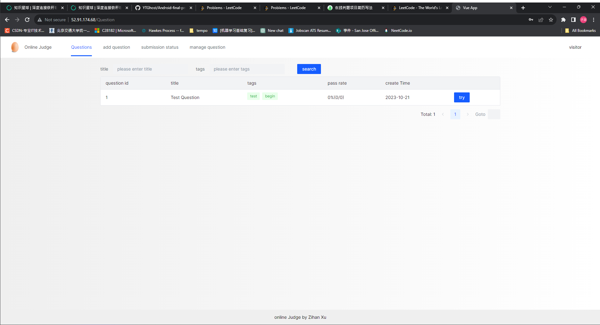
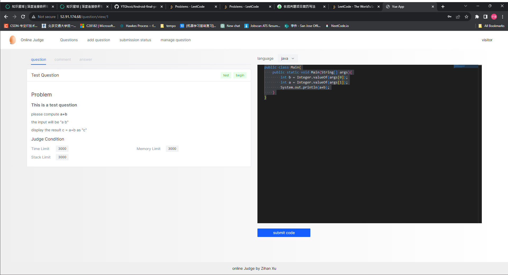
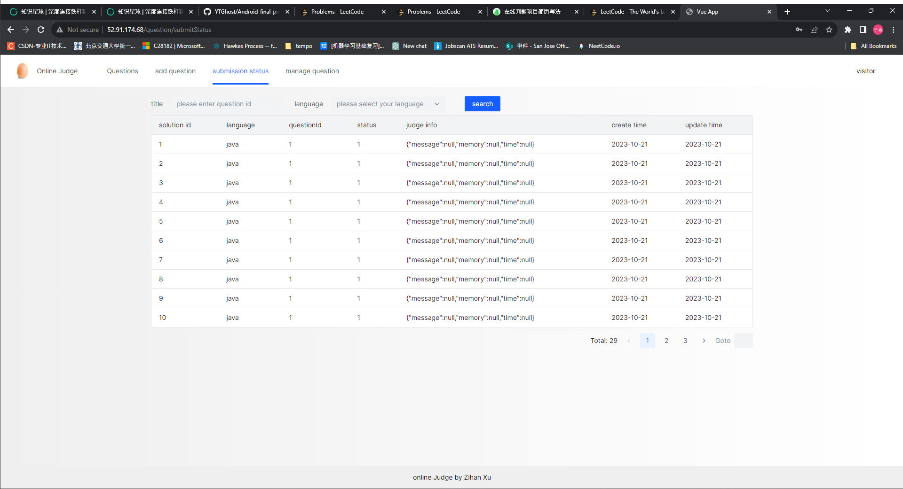
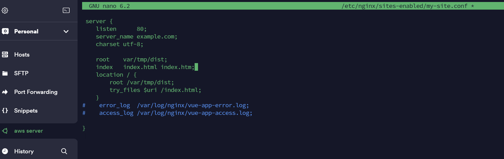

# online judge platform 
## Document 
API document: http://52.91.174.68:8000/api/doc.html#/home

database file: /oj-backend/sql/create_table.sql

front-end repo: https://github.com/xuzihan125/oj-code-sandbox

sandbox repo: https://github.com/xuzihan125/oj-code-sandbox/

# Project Introduction
The project adopts a development model that separates the front end, back end and the code-sandbox. The front page sends Http requests to the back end, the back end returns Json data. If necessary, the back ends send request to the sandbox, which runs the code and return the result. 

This project is deplooyed on the AWS EC2 server, using Nginx as the reverse proxy web server.

### question list page 

### question answer

### solution check

# Experience Address
http://52.91.174.68/

## Project Architecture
### Front-End
VUE3 + Acro Design + openapi-typescript-codegen + ByteMD + Manoco Editor
1. Based on VUE3 + Acro Design component Library, implemented pages like question listing and managing, question answering, solution judging status check, and user logging.   
2. Used the Vue-CLI scaffolding to initialize the project and independently developed a global page layout for future reuse.
3. Used TypeScript + ESLint + Prettier + Husky to ensure project coding and submission standards, and to improve project quality.
4. Authorization management: added an 'access' field to the 'meta' attribute of VUE Router routes to define page permissions. Verified user permissions through the global 'beforeEach' route guard. Encapsulated all permission-checking related code into an 'access.ts' module to simplify usage.
5. Global status management: defined a 'User Module' based on Vuex to store user login status. Used the Composition API(useStore) to access user information from different pages. 
6. Global navigation: automatically generated the navbar based on VUE Router. Used the 'hidden' field in the 'meta' attribute to centrally control page visibility.
7. Front-end and back-end collaboration: used tool "openapi-typescript-codegen" to automatically generate request code based on Swagger documentation, increased develop speed.
9. Used "ByteMD" open source MarkDown editor component, introduced GFM plugin to support table syntax, and encapsulate reusable Editor and Viewer, which enabled better display question detail 
10. Integrated "Manoco Editor" open source code editor component based on "Webpack", encapsulate reusable Editor and Viewer, which enabled user edit their code online

### Back-End
Springboot + Mybatis + Docker + Swagger3 + log4j
1. System Architecture: Based on functional responsibilities, divided system into backend modules (responsible for core business), judging modules (responsible for verifying results), and a reusable code sandbox (responsible for compiling and executing code). Each module is independent and collaborates through API interfaces and sub-packages.
2. Database Design: Independent designed user tables, question tables, and solution submission tables based on business processes, with the addition of a user ID index to improve retrieval performance.
3. Independent designed judging module architecture, defining abstract call interfaces for code sandboxes and multiple implementation classes (e.g., remote sandbox/third-party code sandboxes). Flexibility in calling various code sandboxes is achieved through the static factory pattern and Spring configuration.
4. Used proxy pattern to enhance the capabilities of the code sandbox interface, uniformly implemented logging before and after code sandbox calls to reduce duplicate code.
5. used strategy pattern to replace if-else and encapsulated judging algorithms for different languages, enabled judging algorithms judge for different condition (e.g., Java questions with additional memory limits) and enhancing the system's maintainability.
6. Used the exec method of the Java Runtime object to compile and execute Java programs, and obtained the execution result through the input stream of the Process class, achieving a native Java code sandbox.
7. Control over user-submitted code is implemented using the Java Security Manager and a custom Security Manager. This includes closing write file and execute file permissions, further enhancing the security of the code sandbox. 8
8. Used Docker to isolate user code, ensuring the stability of the sandbox host. The Docker Java library is used to create container isolation for executing code, and interaction with tty and Docker parameters ensures a more secure code sandbox. 
9. Used "HostConfig" to limit container memory and network isolation, enhancing the security of the Docker code sandbox. Container execution timeouts are set to resolve resource release delays. 
10. Used a template method pattern to define a standard process and allow subclasses to extend specific parts of the process, as the implementation process for both native Java and Docker code sandboxes are identical (compilation, execution, output retrieval, and cleanup). This improves code consistency and significantly simplifies redundant code.

### AWS Server
Nginx configuration is as follows:

